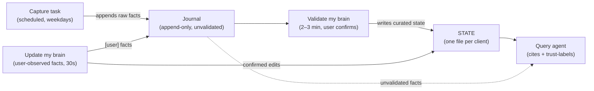

# Copilot Second Brain

**Status: pilot.**

## What it is

The Copilot Second Brain (CSB) is a per-user, per-client working memory built entirely on
Microsoft 365 Copilot: **Cowork** maintains it, a declarative Copilot **agent** answers
questions from it, and it lives as plain markdown files on your own OneDrive. It requires
nothing outside M365 — no local tooling, no third-party services, nothing to install. Every
user runs their own instance, on their own clients, set up once through a guided interview:
no client name, agency name or person is hardcoded anywhere in this kit. "Client" is simply
the word the kit uses for whatever you organise around — the interview asks whether that's a
client, an internal project or a person you support, and a single email address identifies an
entry just as well as a company domain does.

## What it gives you

Ask your Copilot agent something like:

> "Where are we with client X, and what am I waiting on?"

and get back an answer that is **cited** (which file it came from), **dated** (when that
fact was recorded, not today), and **trust-labelled** (validated fact, or
captured-but-not-yet-checked — the agent always says which). When the one-line record isn't
enough, the agent retrieves the original email or meeting from Outlook/Teams itself and
keeps the two layers separate. Before telling you something *hasn't* happened, it checks
your mailbox live instead of trusting its own silence.

## How it works

Two roles, strictly split: **Cowork writes, the agent reads.**

- **Capture** reads Outlook, Teams (listed channels + chats with your team) and Box on a
  schedule and appends one-line facts to each client's journal — raw, unvalidated, never
  rewritten. Attribution runs on the client's email domain, never on people's names.
- **Validation** ("Validate my brain", every day or two) walks what capture proposed —
  accept, amend or reject, one at a time, evidence shown — and turns confirmed facts into
  curated per-client state.
- **Quick update** ("Update my brain: …", whenever) records what no sweep can see — a call,
  a Slack message, a hallway decision — the moment you learn it. Journal line plus, with
  your confirmation, the STATE edit. Thirty seconds, and the brain stops being stale.
- **The agent** reads both layers and always says which one it's using.

Every fact carries a provenance tag (`[captured, unvalidated]`, `[user]`, `[seeded]`) saying
**who wrote it** — a tag never changes, because journal lines are never rewritten. What has
been *reviewed* is a separate question, answered by position: each validation session appends
a `ritual` line to every client's journal, and the agent-written lines below the last one are
the backlog. That is what capture re-proposes, and what the agent flags as unvalidated —
so an unwalked fact keeps coming back until you have actually seen it. STATE has one standing
guarantee: **every line in it passed through you.**

## Day to day

Three verbs, all by name, nothing to remember:

| You want to… | Say | Where |
|---|---|---|
| Know where things stand | ask anything | the **Copilot Second Brain** agent |
| Record something you just learned | **"Update my brain: <the fact>"** | Cowork |
| Review what capture found | **"Validate my brain"** | Cowork |

One habit makes it all reliable: after the brain updates, **start a new chat** with the
agent — an open chat is a snapshot, not a live view (the agent will remind you).

## What it needs

Microsoft 365 Copilot, with Cowork and agent builder access. Nothing else — no Claude Code,
no external memory store, no browser extension.

## Setup

→ [`SETUP.md`](SETUP.md) — self-service, about 10 minutes, four steps with every field
spelled out, no prior knowledge of any tool assumed:

1. **Onboarding interview** (paste into Cowork) — builds your configuration and starting
   state by asking you questions, one at a time.
2. **Scheduled capture task** (paste into a Cowork scheduled task) — the daily sweep.
3. **Query agent** (agent builder) — name, required description and instructions all
   provided, ready to paste; knowledge source = your `Documents/Cowork/Second Brain/`
   folder.
4. **The two Cowork skills** (copy two folders) — `validate-my-brain` and
   `update-my-brain`.

Added a Teams channel later? [`prompts/channel-backfill.md`](prompts/channel-backfill.md)
pulls its history in once — setup guide has the how.

## What's in this repository

| Path | What it is |
|---|---|
| [`SETUP.md`](SETUP.md) | The step-by-step setup guide (start here) |
| [`prompts/onboarding-interview.md`](prompts/onboarding-interview.md) | Builds a new user's brain, interview-style |
| [`prompts/capture-task.md`](prompts/capture-task.md) | The scheduled daily capture |
| [`prompts/agent-instructions.md`](prompts/agent-instructions.md) | The query agent: creation steps + paste block |
| [`prompts/channel-backfill.md`](prompts/channel-backfill.md) | One-off: pull a newly added Teams channel's history |
| [`skills/validate-my-brain/`](skills/validate-my-brain/SKILL.md) | Cowork skill: the validation session |
| [`skills/update-my-brain/`](skills/update-my-brain/SKILL.md) | Cowork skill: the quick user-observed-fact update |
| [`docs/ARCHITECTURE.md`](docs/ARCHITECTURE.md) | The full design: layout, the five surfaces, trust model, failure modes |

Everything that runs inside Copilot is **versioned here first** (each file carries a
`Version:` line) and then pasted or copied into Cowork / agent builder. When a file changes
here, its Cowork-side copy is re-pasted — the version line is how you spot a stale copy.
**No user data ever enters this repository**: your configuration, state and journals live
only on your OneDrive.

## Design

→ [`docs/ARCHITECTURE.md`](docs/ARCHITECTURE.md) — layout, configuration, the five
surfaces, the validation model, how the system fails and how you notice, and what's still
open.

## Licence

[Apache-2.0](LICENSE). Nothing in the kit is meant to be used unmodified: install it on
your own Microsoft 365 account, adapt the prompts and skills to your own clients, change
whatever you like.

**No user data lives here.** Configuration, state and journals live on each user's own
OneDrive and have no route into this repository. If you find anything here that looks like
someone's client data, that is a defect — please open an issue rather than working around
it.
